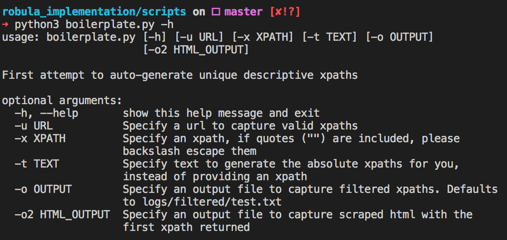
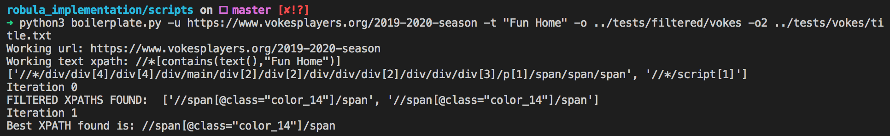
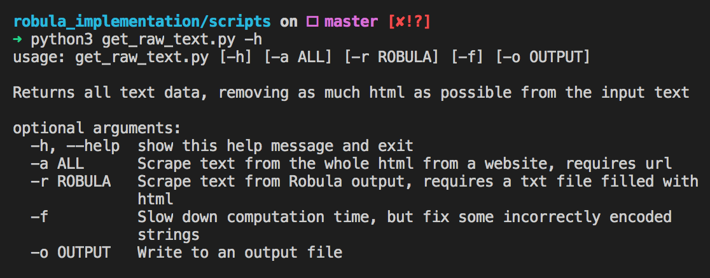

# A Modified Python Implementation of Robula+, currently called Robula-
### (Name suggestions are welcome)

**Warning:** This repo is constantly being updated. Please check back and reread the README for up-to-date info. 

## Some Notes: 
Our earliest iteration takes in an absolute xpath and a url, and outputs a generic xpath that can identify all elements above the element caught by the initial xpath passed in.

We have been working to remove the task of finding that initial absolute xpath, and instead start with a keyword that we believe could be inside the website. 

Our current version allows the user to utilize the -t flag in boilerplate.py (name-change inbound) and pass in a keyword that exists within the site, and our scripts will try and find anything related to that keyword 

# Flag Options: 

# How to Run: 

All the important scripts are found within the `scripts` folder. `cd scripts` after cloning this repo to run some commands 
We highlight the most used tools below.

### Pass in a URL and Keyword and print results to screen (BETA)
`python3 boilerplate.py -u https://a-url-that-you-like.com -t "Text that exists"`

### Pass in a URL and Keyword and print xpaths to a specified location, html results in another location
`python3 boilerplate.py -u https://a-url-that-you-like.com -t "Text" -o /logs/filtered/location -o2 /logs/location/title.txt`

**Note:** The -o2 flag allows the user to save html scraped using Robula's generated xpaths. Our current iteration saves multiple attempts seperated by a SCORE:. You can filter out the html elements and recover the bare text by running: 

`python3 get_raw_text.py -r /path/to/file.txt -o /path/to/outputfile.txt`

If you want to get fancy, we have an experimental -f flag that catches some faulty UTF-8 encodings and regenerates the text that your website may have. Here's the flag breakdown for get_raw_text: 

We also have a function that you can use to filter out html (if you don't want it as a command-line tool). Read inside get_raw_text if interested. 

### Pass in a URL and an xpath and save the xpaths to a specific location
`python3 boilerplate.py -u https://a_valid_url.com -x //a/valid/xpath/here -o /logs/filtered/genericxpaths.txt`

### Pass in a URL and xpath and print to screen 
`python3 boilerplate.py -u https://a_valid_url.com -x //a/valid/xpath/here`

Currently, file-saving is the best option, so abuse the `-t` flag above all others. 

# Data log 

## June 6th 2020 
We were able to begin implementing a first draft today, with some small bugs at the end of the session.
Next steps: begin unit testing, fix transfAddlevel, implement removeposition. 

## June 13th 2020
Able to get a general xpath for all urls, descriptions, and dates for newartcenter. 
We found 65 events within newartcenter/classes, their dates, instructors, and descriptions. 
Next steps include starting with an absolute xpath and working up the tree to remove 
text overhead found within example log txt files like mfa-title.txt

## June 20th 2020 
Able to strip all unnecessary html from output logs using simple regex. A little issue with handling UTF-8 encodings of right double quotes, currently ignoring any errors (\x9d is the weirdest encoding we've gotten). We tested on the current log data and outputted "fixed" versions of the logs. Still working on generating absolute xpaths to feed Robula. 

## June 21 2020 
We added absolute_xpath.py to generate absolute xpaths given a piece of text and a url. Further functionality could include testing with id, class, tag_name, and links as well. We integrated absolute_xpath.py to boilerplate (the -t flag) for using this new tool alongside our Robula implementation. We have done some minor unit tests, and found some decent results when testing with text that exists within the page. A fatal error occured at the end of our session, which we believe could have something to do with the timeout library. Restructuring our timing system with Robula and the text flag will ensue. Also added output flags to generate log files (xpaths and scraped html)
